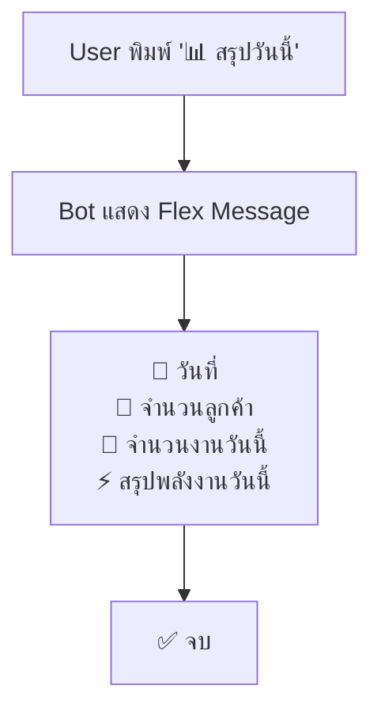
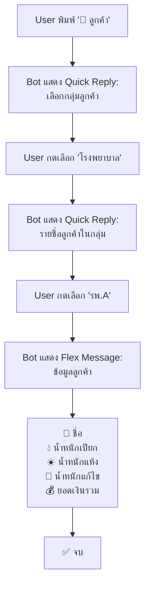
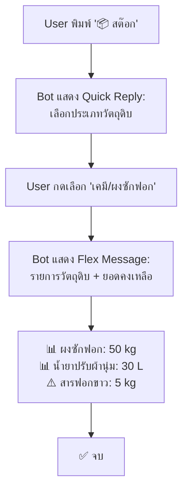
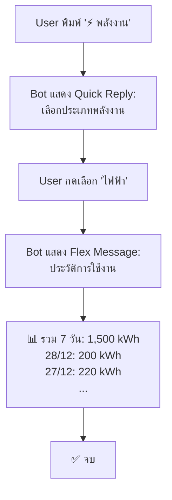
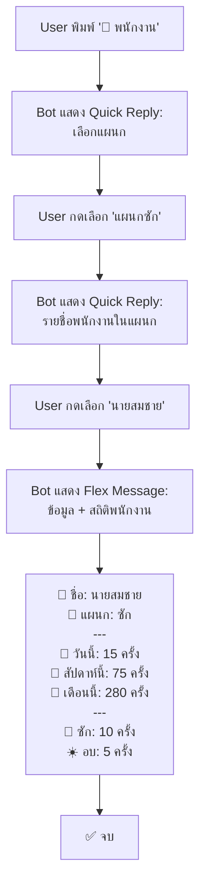
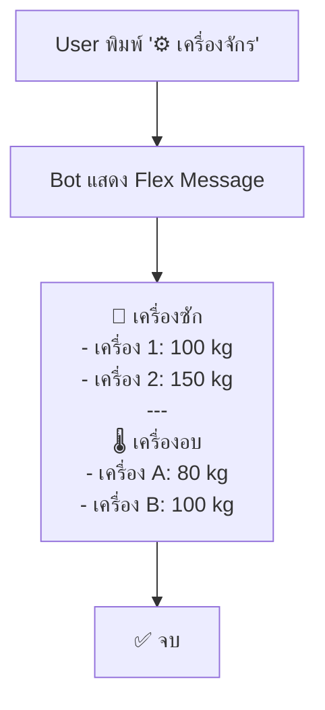
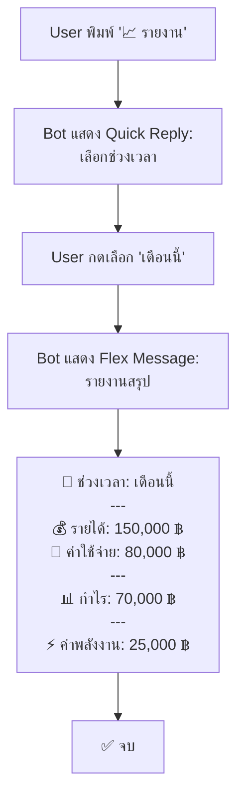
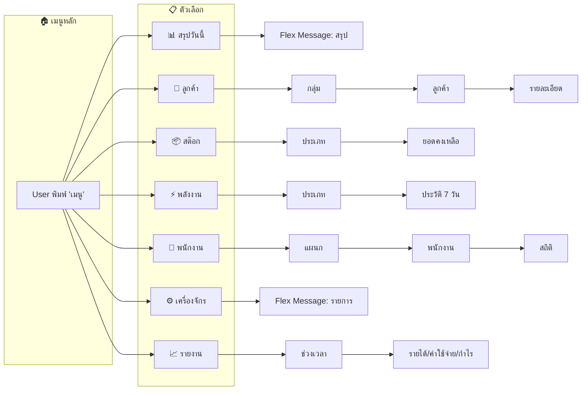

# 📱 LINE OA Use Cases - LinenSoftTech

เอกสารอธิบาย Use Case และ User Flow ของ LINE OA Chatbot สำหรับระบบ LinenSoftTech

---

## 📋 สรุปเมนูทั้งหมด

| เมนู | ความลึก | คำสั่ง/Keyword |
|------|---------|---------------|
| 📊 สรุปวันนี้ | 1 ชั้น (จบทันที) | `สรุปวันนี้`, `summary` |
| 👥 ลูกค้า | 3 ชั้น | `ลูกค้า`, `customer` |
| 📦 สต๊อก | 2 ชั้น | `สต๊อก`, `stock`, `inventory` |
| ⚡ พลังงาน | 2 ชั้น | `พลังงาน`, `energy` |
| 👷 พนักงาน | 3 ชั้น | `พนักงาน`, `employee` |
| ⚙️ เครื่องจักร | 1 ชั้น (จบทันที) | `เครื่องจักร`, `machine` |
| 📈 รายงาน | 2 ชั้น | `รายงาน`, `report` |

---

## 🎬 Use Case Flows

### 1. 📊 สรุปวันนี้ (ลึก 1 ชั้น)

**วัตถุประสงค์:** ดูภาพรวมการทำงานของโรงซักรีดในวันนี้

**ข้อมูลที่แสดง:**
- วันที่ปัจจุบัน
- จำนวนลูกค้าทั้งหมดในระบบ
- จำนวน Operation ที่สร้างวันนี้
- สรุปการใช้พลังงานวันนี้ (น้ำ/ไฟ/แก็ส)

**Models ที่ใช้:** `Customer`, `Operation`, `EnergyResourceLog`

---

### 2. 👥 ลูกค้า (ลึก 3 ชั้น)

**วัตถุประสงค์:** ค้นหาและดูข้อมูลลูกค้ารายละเอียด

**ขั้นตอน:**
1. **ชั้นที่ 1:** เลือกกลุ่มลูกค้า (เช่น โรงพยาบาล, โรงแรม, อื่นๆ)
2. **ชั้นที่ 2:** เลือกลูกค้าในกลุ่ม (เช่น รพ.A, รพ.B)
3. **ชั้นที่ 3:** แสดงรายละเอียดลูกค้า (น้ำหนัก, ยอดเงิน)

**Models ที่ใช้:** `CustomerGroup`, `Customer`

---

### 3. 📦 สต๊อก (ลึก 2 ชั้น)

**วัตถุประสงค์:** ตรวจสอบยอดคงเหลือวัตถุดิบ

**ขั้นตอน:**
1. **ชั้นที่ 1:** เลือกกลุ่มวัตถุดิบ (เคมี, ถุงพลาสติก, วัสดุทั่วไป)
2. **ชั้นที่ 2:** แสดงรายการวัตถุดิบ + ยอดคงเหลือ (สีแดงถ้าน้อยกว่า 20%)

**Models ที่ใช้:** `InventoryGroup`, `Inventory`

**หมายเหตุ:** ยอดที่เหลือน้อยกว่า 20% ของทั้งหมดจะแสดงเป็น **สีแดง** ⚠️

---

### 4. ⚡ พลังงาน (ลึก 2 ชั้น)

**วัตถุประสงค์:** ติดตามการใช้พลังงาน

**ขั้นตอน:**
1. **ชั้นที่ 1:** เลือกประเภทพลังงาน (น้ำ, ไฟฟ้า, แก็ส, ชีวมวล, น้ำมันเตา)
2. **ชั้นที่ 2:** แสดงสรุปรวม 7 วัน + ประวัติรายวัน

**Models ที่ใช้:** `EnergyResource`, `EnergyResourceLog`

---

### 5. 👷 พนักงาน (ลึก 3 ชั้น) 🆕

**วัตถุประสงค์:** ดูรายชื่อพนักงานและสถิติการทำงาน

**ขั้นตอน:**
1. **ชั้นที่ 1:** เลือกแผนก (ซัก, อบ, รีด, พับแพ็ค, จัดเก็บ)
2. **ชั้นที่ 2:** เลือกพนักงานในแผนก
3. **ชั้นที่ 3:** แสดงข้อมูลพนักงาน + สถิติการทำงาน

**ข้อมูลสถิติที่แสดง:**
- จำนวน Operation วันนี้
- จำนวน Operation สัปดาห์นี้
- จำนวน Operation เดือนนี้
- แยกตามประเภทงาน (ซัก/อบ/รีด/พับแพ็ค/จัดเก็บ)

**Models ที่ใช้:** `Department`, `Employee`, `EmployeeOperationLog`

---

### 6. ⚙️ เครื่องจักร (ลึก 1 ชั้น)

**วัตถุประสงค์:** ดูรายการเครื่องจักรทั้งหมด

**ข้อมูลที่แสดง:**
- รายชื่อเครื่องซัก + ความจุสูงสุด
- รายชื่อเครื่องอบ + ความจุสูงสุด

**Models ที่ใช้:** `WashingMachine`, `DryerMachine`

---

### 7. 📈 รายงาน (ลึก 2 ชั้น) 🆕

**วัตถุประสงค์:** ดูสรุปรายได้ ค่าใช้จ่าย และกำไรขาดทุน (สำหรับ Manager)

**ขั้นตอน:**
1. **ชั้นที่ 1:** เลือกช่วงเวลา (วันนี้, สัปดาห์นี้, เดือนนี้, ทั้งหมด)
2. **ชั้นที่ 2:** แสดงรายงานสรุป

**ข้อมูลที่แสดง:**
- 💰 รายได้รวม (Income)
- 💸 ค่าใช้จ่ายรวม (Expense)
- 📊 กำไร/ขาดทุน (สีเขียวถ้ากำไร, สีแดงถ้าขาดทุน)
- ⚡ ค่าพลังงานรวม

**Models ที่ใช้:** `Income`, `Expense`, `EnergyResourceLog`

---

## 🔄 User Flow Diagram (ภาพรวม)

---

## 🛠️ Technical Implementation

### Controller
- **File:** `app/Http/Controllers/Api/LineChatbotController.php`
- **Functions:**
  - `webhook()` - รับ events จาก LINE
  - `handleMessage()` - จัดการข้อความ
  - `handlePostback()` - จัดการ postback (เมื่อ user กด Quick Reply)
  - `sendMainMenu()` - ส่งเมนูหลัก
  - `sendTodaySummary()` - สรุปวันนี้
  - `sendCustomerMenu()` / `showCustomersByGroup()` / `showCustomerDetail()` - เมนูลูกค้า
  - `sendInventoryMenu()` / `showInventoriesByGroup()` - เมนูสต๊อก
  - `sendEnergyMenu()` / `showEnergyLogs()` - เมนูพลังงาน
  - `sendEmployeeMenu()` / `showEmployeesByDepartment()` / `showEmployeeDetail()` - เมนูพนักงาน
  - `sendMachineStatus()` - เมนูเครื่องจักร
  - `sendReportMenu()` / `sendReportSummary()` - เมนูรายงาน 🆕

### Service
- **File:** `app/Services/LineMessagingService.php`
- **Functions:**
  - `verifySignature()` - ยืนยันความถูกต้องของ request
  - `replyMessage()` - ส่งข้อความตอบกลับ
  - `textMessage()` - สร้างข้อความ text
  - `quickReply()` - สร้าง Quick Reply
  - `flexMessage()` - สร้าง Flex Message
  - `bubbleContainer()` - สร้าง Bubble สำหรับ Flex
  - `infoRow()` - สร้างแถวข้อมูล
  - `separator()` - สร้างเส้นแบ่ง

---

## 📱 UI Components

### Quick Reply
ปุ่มเลือกที่แสดงด้านล่างแชท (แสดงเฉพาะ Mobile)

### Flex Message
ข้อความที่มี layout สวยงาม แสดงเป็น Card

---

## 🔮 อนาคต (Roadmap)

- [ ] เพิ่ม Rich Menu (เมนูรูปภาพด้านล่าง)
- [ ] เพิ่ม Push Message แจ้งเตือน (เช่น สต๊อกใกล้หมด)
- [ ] เพิ่ม AI ตอบคำถามอัจฉริยะ
- [ ] เพิ่มรายงาน PDF ส่งผ่าน LINE
